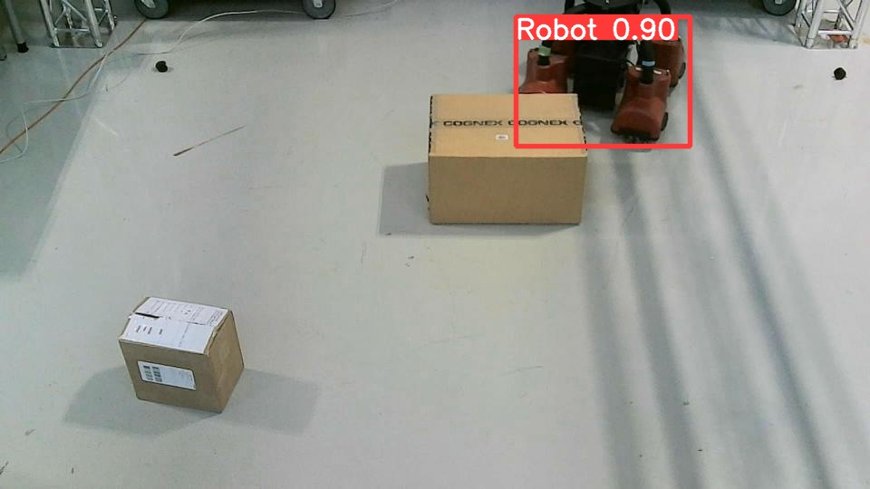

# Baxter Mobility Base Detection

This repository documents the process of creating a custom object detection model to detect the **Baxter mobility base** in warehouse settings. The project includes dataset preparation using **Roboflow**, training a **YOLOv5** model on GPU hardware, and detailed instructions for replicating the training and evaluation process.

## Table of Contents

- [Project Overview](#project-overview)
- [Why YOLOv5?](#why-yolov5)
- [Dataset Details](#dataset-details)
  - [Dataset Versioning](#dataset-versioning)
  - [Preprocessing and Augmentations](#preprocessing-and-augmentations)
- [Model Training](#model-training)
  - [Training Setup](#training-setup)
  - [Training Results](#training-results)
- [Model Testing](#model-testing)
- [Sample Results](#sample-results)
- [How to Replicate](#how-to-replicate)
- [Acknowledgements](#acknowledgements)

---

## Project Overview

This project tackles the challenge of detecting the **Baxter mobility base** in warehouse environments to enable robotic navigation and automation. We trained a **YOLOv5** model to perform object detection with high accuracy, even under challenging scenarios such as occlusions.

---

## Why YOLOv5?

**YOLOv5** was chosen for this project due to its speed, accuracy, and robustness in object detection. We used the **YOLOv5 large model (YOLOv5l)**, which provides a good balance between performance and computational efficiency, especially when training on larger datasets.

### YOLOv5 Configuration for This Project
The model was configured with the following settings:

- **Number of Classes** (`nc`): `1`, since the task is to detect only one object, the **Baxter mobility base**.
- **Depth Multiple** (`depth_multiple`): `0.33`, which scales the depth (number of layers) of the model. A lower value results in a lighter model that is faster to train and infer.
- **Width Multiple** (`width_multiple`): `0.50`, which scales the width (number of filters) of the model layers. This reduces the number of parameters, optimizing for speed while maintaining accuracy.

**Anchors**: These define the predefined bounding box shapes used for detecting objects at different scales:
  - P3/8: `[10,13, 16,30, 33,23]`
  - P4/16: `[30,61, 62,45, 59,119]`
  - P5/32: `[116,90, 156,198, 373,326]`

**Backbone**: The backbone is responsible for extracting features from images. The architecture used here is based on several **BottleneckCSP** blocks with different channel sizes:
  - `Conv` layer with 64 filters, stride 2.
  - Followed by **BottleneckCSP** blocks with increasing channels (128, 256, 512, 1024).

**Head**: The head is responsible for making predictions based on the extracted features. It consists of further **BottleneckCSP** layers and a convolutional layer, followed by an **Upsample** layer for predicting bounding boxes at multiple scales:
  - **BottleneckCSP** with 512 channels.
  - **BottleneckCSP** with 256 channels.
  - A final `Conv` layer followed by an `Upsample` layer for detection outputs.

These settings were chosen to ensure a good trade-off between performance and efficiency for detecting the Baxter mobility base.

---

## Dataset Details

### Dataset Versioning

The dataset used in this project was created and managed using **Roboflow**, which facilitates dataset creation, labeling, and export in various formats, including YOLOv5. The dataset configuration is as follows:

- **Total Images**: `1938`
- **Image Resolution**: `1280x720` (resized using the "Stretch to" method)
- **Dataset Split**:
  - **Train Set**: `83%` (1609 images)
  - **Validation Set**: `9%` (165 images)
  - **Test Set**: `8%` (164 images)

### Preprocessing and Augmentations

- **Resize**: All images were resized to `1280x720` using the "Stretch to" preprocessing method in **Roboflow**.
- **Augmentations**: No augmentations were applied during preprocessing.

**Annotation Format**: YOLOv5 format (`.txt` files with bounding boxes and labels), where each annotation file corresponds to an image and contains the class label and bounding box coordinates.

### About `data.yaml`

The **`data.yaml`** file is generated by **Roboflow** when you export the dataset in YOLOv5 format. This file is crucial for training as it defines:
- The paths to the training, validation, and test image directories.
- The number of object classes in your dataset (`nc`).
- The names of the classes, ensuring YOLOv5 knows which objects to detect.

When exporting your dataset from Roboflow, a ready-to-use `data.yaml` file is included in the exported ZIP, which can be directly used in your YOLOv5 training script. This simplifies dataset preparation, ensuring everything is in the correct format.

**Note**: For proprietary reasons, the data.yaml file and dataset are not shared in this repository. You can generate your own data.yaml by exporting your dataset from Roboflow in YOLOv5 format.

---

## Model Training

### Training Setup

The model was trained using the **YOLOv5 large (YOLOv5l)** architecture with the following settings:

- **Hardware**: NVIDIA T4 GPU
- **Batch Size**: 8
- **Epochs**: 100
- **Image Size**: 1280
- **Optimizer**: SGD
- **Loss Function**: YOLOv5 default

### Training Results

Key metrics achieved are as follows:

| Metric        | Value      |
|---------------|------------|
| **Precision (P)**  | `0.99`      |
| **Recall (R)**     | `1.0`       |
| **mAP@0.5**        | `0.995`     |
| **mAP@0.5:0.95**   | `0.893`     |

Training logs (epoch 74/99):
```
Epoch   gpu_mem       box       obj       cls    labels  img_size
99/99     8.21G   0.01273  0.005138         0         1      1280
```

Validation metrics:
```
Class     Images     Labels          P          R     mAP@.5 mAP@.5:.95
all        165        111       0.99          1      0.995      0.893
```

Additionally, I generated a training results graph using the YOLOv5 utility:
```python
from utils.plots import plot_results  # plot results.txt as results.png
Image(filename='/content/yolov5/runs/train/yolov5s_results/results.png', width=1000)
```

*This graph visualizes training performance, including loss and mAP metrics.*

---

## Model Testing

The model was tested on a separate test set containing 164 images. It performed exceptionally well, even under conditions of partial occlusion. The confidence scores (e.g., `Robot 0.9`) represent the model's certainty in detecting the Baxter mobility base in the image.

---

## Sample Results

Below are sample results from model inference on test images:

1. **Image 1**: Detection with confidence: `Robot 0.74`
   

2. **Image 2**: Detection with confidence: `Robot 0.94`
   

3. **Image 3**: Detection with confidence: `Robot 0.90` (occluded)
   

These results demonstrate the robustness of the model in accurately identifying the Baxter mobility base, even in challenging scenarios.

---

## How to Replicate

To replicate this project, follow these steps:

### Step 1: Clone the Repository
```bash
git clone https://github.com/arekhtiwari/baxter-mobility-base-detection.git
cd baxter-mobility-base-detection
```

### Step 2: Install Dependencies
Install the required Python packages:
```bash
pip install -r requirements.txt
```

### Step 3: Prepare the Dataset
Download the dataset from Roboflow and configure it in YOLOv5 format. Ensure the `data.yaml` file points to the correct dataset paths.

### Step 4: Train the Model
Train the YOLOv5 model using the provided training script:
```bash
python scripts/train.py --img 1280 --batch 8 --epochs 100 --data data.yaml --weights yolov5l.pt
```

### Step 5: Test the Model
Evaluate the trained model on the test dataset:
```bash
python scripts/val.py --weights runs/train/exp/weights/best.pt --data data.yaml --img 1280
```

### Step 6: Inference
Run inference on new images:
```bash
python scripts/detect.py --weights runs/train/exp/weights/best.pt --img 1280 --source /path/to/images
```

**Note**: Follow the provided scripts and steps to train and evaluate the model. The saved model itself is not shared in this repository.

---

## Acknowledgements

- **YOLOv5**: For providing the robust object detection framework.
- **Roboflow**: For dataset creation and management.
- **Google Colab**: For enabling GPU-based model training on NVIDIA T4 hardware.
